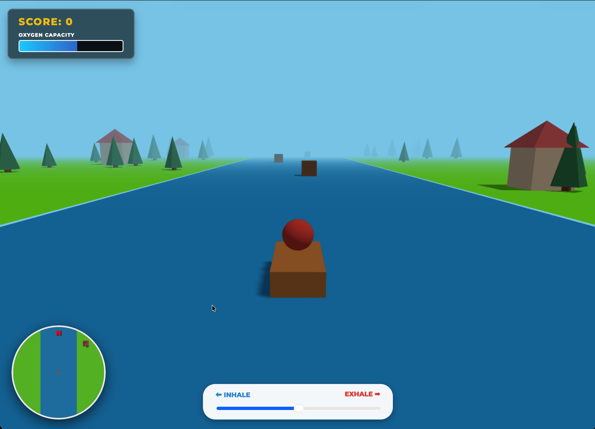

# Super Lung Hero - Game-Based Digital Respiratory Rehab

**Super Lung Hero** is a 3D gamified breathing rehabilitation tool designed specifically for post-operative cardiopulmonary patients (e.g., post-CABG, valve replacement). 

By transforming digital handheld spirometer training into an engaging, story-driven game experience, this platform combats low patient engagement and helps improve both inspiratory capacity and expiratory force.

---

## The Problem : 
Post-operative cardiopulmonary patients often suffer from reduced inspiratory capacity, poor lung function, and complications like atelectasis. Up to **40% of CABG patients develop pulmonary complications post-op** (AARC, 2022). Traditional rehabilitation exercises can be monotonous, leading to low patient compliance and prolonged recovery times.

## The Solution : 
Super Lung Hero replaces the repetitive nature of standard breathing exercises with a high-fidelity 3D interactive environment. 

Patients play as a hero on a river rescue mission. Their physical breathing efforts—measured via a digital spirometer—are mapped directly to in-game mechanics:
* **⬅️ Inspiration (Inhale):** Fills the player's "Oxygen Capacity" (recharging energy).
* **➡️ Expiration (Exhale):** Depletes oxygen to propel the boat forward and blast through obstacles.

---

## Features
* **Modern 3D Engine:** Built on Three.js, featuring a stylized, low-poly (PBR) aesthetic with dynamic lighting and soft shadows.
* **Procedural Generation:** Infinite, randomized riverbanks complete with trees, towers, and docks that load instantly without external assets.
* **Cinematic Camera System:** Utilizes a smooth, interpolated chase camera for immersive 3rd-person gameplay.
* **Minimap:** A dedicated Orthographic camera rendered via Scissor Test into a sleek, CSS-styled circular radar UI.
* **Physics & Collision:** Custom distance-based collision detection for interacting with obstacles (crates/barrels) using breath force.
* **Hardware Ready:** Designed to interface seamlessly with an ESP32 microcontroller and pressure sensors via Firebase RTDB (currently utilizing a simulated UI slider for prototyping).

---

## Tech Stack
* **Frontend UI:** HTML5, CSS3 (Modern glassmorphism UI)
* **3D Graphics:** WebGL via **Three.js** (ES6 Modules)
* **Hardware Interface (Planned):** ESP32, Firebase Realtime Database

---

## Running the Project Locally

Because this project uses native ES6 Modules to load Three.js, **you cannot open the `index.html` file directly from your hard drive** (browsers block this due to CORS security policies). You must run it through a local web server.

### Prerequisites
* [Visual Studio Code](https://code.visualstudio.com/)
* VS Code Extension: **Live Server** (by Ritwick Dey)

## Under development